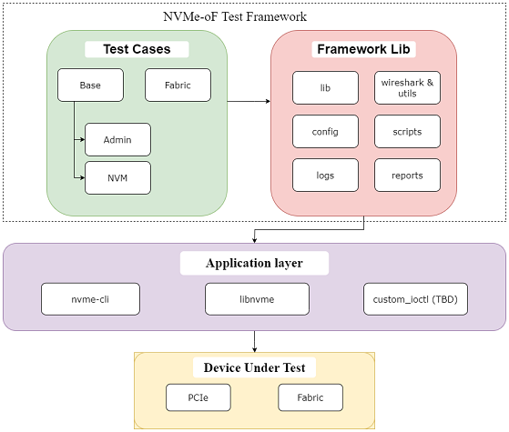

# nvmfabtest
NVMe-oF Compliance Test Suite

## Description
nvmfabtest is a comprehensive test suite written in Python 
It provides both the framework and test cases for ensuring compliance with NVMe-oF standards. The ultimate goal is to contribute to the open-source community by providing a reliable and feature-rich tool for validating adherence to NVMe-oF specifications.

The framework provides two user configurable application options which can be used to communicate with the NVM device. These are [nvme-cli](https://github.com/linux-nvme/nvme-cli) and [libnvme](https://github.com/linux-nvme/libnvme).

## Table of Contents
1. [Installation](#installation)
2. [Usage](#usage)
3. [Features](#features)
4. [Future Work](#future-work)
5. [Design](#design)
6. [Project Structure](#project-structure)
7. [Code Examples](#code-examples)
8. [Advantages of using libnvme in framework](#advantages-of-using-libnvme-in-framework)
9. [License(TBD)](#license)
10. [Acknowledgements(TBD)](#acknowledgements)

## Prerequisites

- **Linux kernel version 4.5 or above.** You can check your version by running the command:
    ```bash
    uname -r
    ```
- **nvme-cli** You can install using the command:
    ```bash
    sudo apt install nvme-cli
    ```
## Installation
To install the NVMe-oF Compliance Test Suite, follow these steps:

1. Clone the repository:
   ```bash
   git clone <url_to_repo>
   ```
2. Navigate to the project directory:
   ```bash
   cd nvmeof_compliance
   ```
3. Install python dependencies:
   ```bash
   pip install -r requirements.txt
   ```

## Usage
To use the NVMe-oF Compliance Test Suite, follow these steps:

1. Configure the test environment according to your setup in `config/ts_config.json` as given below:
    ```json
    {
        "app_name": "",
        "device_path": "",
        "connectByIP": "true",
        "disconnectOnDone": "true",
        "connectDetails": {
            "transport": "",
            "addr": "",
            "svcid": "",
            "index": 0
        },
        "libnvme_path": ""
    }
    ```
    The available options for each field are:
    - `app_name: ["nvme-cli", "libnvme"]`
    - `device_path: ["/dev/nvmeX", "/dev/nvmeXnY",""]` where X and Y are whole numbers
    - `connectByIP: ["true", "false"]`
    - `disconnectOnDone: ["true", "false"]`
    - `connectDetails.transport: ["tcp", "rdma", "loop"]`
    - `connectDetails.addr: "<IP address to target>"`
    - `connectDetails.svcid: "<SVC Port ID>"`
    - `connectDetails.index: [0, <Device index in target>]`
    - `libnvme_path: ["auto", "<Path to libnvme.so file>"]`


2. Run the Test Suite:
    
    In project directory, run:
    ```bash
    pytest
    ```
    To see verbose, run:
    ```bash
    pytest -s
    ```
    To generate html report, run:
    ```bash
    pytest --html=report.html
    ```

For more detailed usage instructions, refer to the documentation [here]() (Not added yet).

## Features
- Object Oriented Framework Design which makes it easy to expand test cases coverage.

- Application layer is abstracted from test cases. Same test cases can run using any of the application layer options chosen. 

- libnvme application allows customizability and control over the command on par with the NVMe specifications. Direct interaction with this library allows us to use an extensive set of APIs which interact with the device on a low level using ioctls. This increases efficiency.

- Requires the code modification only at one place to incorporate driver modifications. 

- Python based framework and Python based test cases, easy to understand and expand.

- Interaction with C libraries and implementation of C structures using [`ctypes`](https://docs.python.org/3/library/ctypes.html) to ensure low level compatibility.

- JSON based user configurations.

- A simple pass-thru interface for executing most of the nvme commands (Admin, IO commands, Fabric) which work with specification adhering structures.


- Test base and fabric commands on fabric devices.

- Option to automatically discover and connect to target device before testing.

## Future Work
- Unittests for entire framework
- Framework wide use Logging Module which is already created
- Session level setup and teardown using libnvme

## Design


The design involves Test Cases and the Framework Library as the two major components of the Test Suite. The test cases use the framework library for all the definitions they need and the execution of the nvme commands. The framework provides these definitions and executes these commands using one of the application layer methods. The application used will communicate with the Device Under Test which can be a PCIe or Fabric Device.

## Project Structure

- libs
    - applib - Contains the application's wrapper files for the different applications (NVMe-CLI/Libnvme/CustomIOCTL).
    - devlib - Contains the device specific API support. The device can NVMe Base/Fabric devices or CXL device.
    - cmdlib - Contains the commands supports which can be executed on the given device type.
    - structlib - Contains the ctypes structures required throughout the framework and testcases.
- configs - Contains the configuration files of the project. The config files are written in Json or ini format.
- scripts - Contains the supporting scripts for the project.
- utils - Contains the utility files of the project. The logger files are present in utils directory.
- datafile - Contains the data or information required to store the test data.
- logs - Contains the execution logs and report of the run.
- testcases - Contains the testcase subdirectory for tests.

## Code examples

Sample Test Case:

```python
class TestNVMeConnect:

    @pytest.fixture(scope='function', autouse=True)
    def setup_method(self, dummy):
        ''' Setup Test Case by initialization of controller object '''

        self.dummy = dummy
        device = self.dummy.device
        application = self.dummy.application
        self.controller = Controller(device, application)
```
```python
    def test_sample(self):
        ''' Perform test '''

        # Get the required structure from self.controller.cmdlib
        nvme_cmd = self.controller.cmdlib.get_property_get_cmd()

        # Make required modifications as per the test scenario
        offset = 0x14
        nvme_cmd.cmd.generic_command.cdw11.raw = offset

        # Allocate memory for the expected response 
        # according to the command and store in nvme_cmd.buff
        get_property_value = ctypes.c_uint64()
            nvme_cmd.buff = ctypes.addressof(get_property_value)

        # Send the command
        res_status = self.controller.app.submit_passthru(nvme_cmd, verify_rsp=True, async_run=False)
        
        # Make Testing assertions according to scenario 
        # using the response data and response status
        if res_status!=0:
            assert False
        if get_property_value.value == 0:
                assert False, f"No value obtained"
            assert True
```
```python
    def teardown_method(self):
        '''Teardown test case'''

        # Any memory freeing or disconnections to be made 
        # after test case completion
        
```

## Advantages of using libnvme in framework

- Ability to directly use C library for faster processing and low level control while still writing the test cases in python.

- Time Comparison for sending 100 identify commands:
    
    - libnvme: `996.8068599700928 ms`
    - nvme-cli: `1001.1849403381348 ms`

- libnvme itself adheres to the NVMe Specifications and hence does not pose challenges to test compliance from it's own internals. 

- Reduce the overhead of using subprocess and command response parsing

- Option to use nvme-cli interface for nvme command execution as per requirement.
